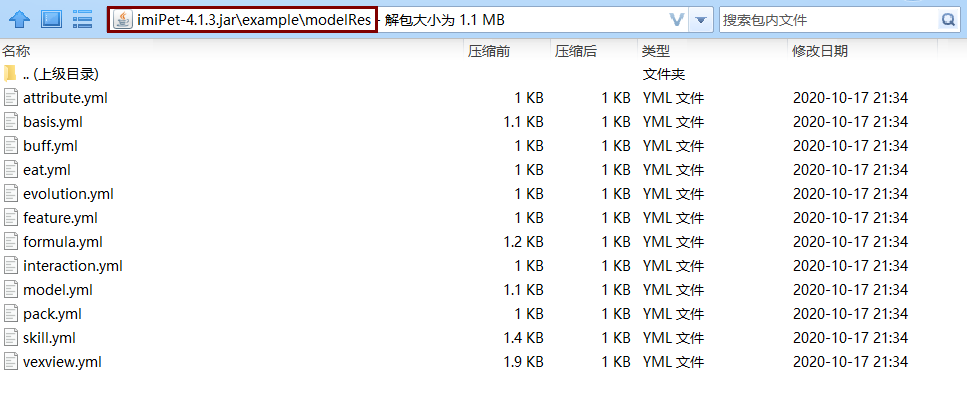

# Model file structure


The first step is to quickly understand the file structure


```text
models  # Store model configuration files
  xxx  # Name whatever
    ├─model.yml  # Model ID and normal dynamic action [Required]
    ├─pack.yml  # Automatically generate texture resource package [optional]
    ├─pack  # Place the texture resource pack [if pack.yml enables automatic generation of texture resource pack]
    ├─skill.yml  # Model Skill Dynamic Action [Optional]
    ├─basis.yml  # Basic value [Required]
    ├─formula.yml  # Related formula [Required]
    ├─feature.yml  # Other functions [Required]
    ├─interaction.yml  # Interactive information [Required]
    ├─eat.yml  # Hand-held feeding [Required]
    ├─evolution.yml  # About evolution [required]
    ├─attribute.yml  # Other external attributes [Optional]
    ├─buff.yml  # Buff [Optional]
    └─vexview.yml  # About VexView [Optional]
```


Sample configuration is built in after version 4.1.3+


Please open the imiPet plugin as ZIP



