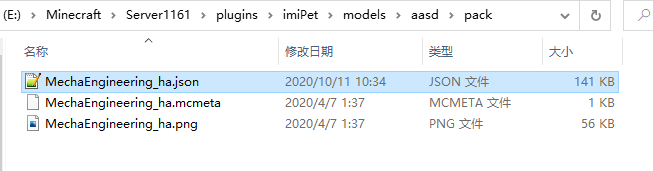

# pack.yml

## what is this

This is about the configuration of automatically generating texture resource packs

## Step 1

Directory: plugins\imiPet\models\models\pack.yml \(create by yourself\)


optiFine requires optiFine-Mod \(latest\) to identify the name of the item and assign a material model

customModelData is to judge the item data and assign the material model, no MOD is required, but only supports Minecraft 1.14+

all, is to generate optiFine and customModelData


```text
# Whether to automatically generate texture packs
autoSpawn: false
# pack type
#   optiFine
#   customModelData
#   all
type: "optiFine"

```

## Step 2

After the configuration is set 

You need to be in the directory: plugins\imiPet\models\models

Create a folder named pack, and put texture materials \(json\[model\], png\[texture\], mcmeta\[dynamic\]\) into it

## Step 3

Change the name of the texture material you just put in as follows \(except for the suffix\):

* idle \(if the texture pack is idle, please change to idle\)
* walk \(similarly, walking state\) 
* attack \(similarly, attack state\) 
* Skill\_AnimationID \(Texture material of other actions, according to skill.yml

As shown in the figure \(the skill is **MechaEngineering**, the animationID is **ha**\)



## Step 4

Start the server or /imiPet reload

Will be generated in the directory plugins\imiPet

Then resourcePack is the texture resource pack you need to use

Wait a minute, you still have one job: [pack.mcmeta](../../../texture-and-model-display/texturemodel.md#常见问题)

## Finally

Load texture resource package into the client

