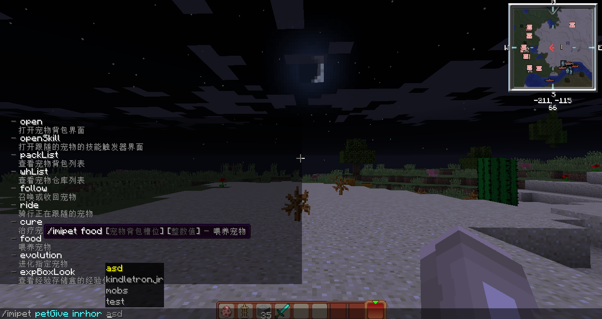

# 常见问题

## Java模型于基岩模型区别

Java模型制作的局限性是非常大的，比如只能旋转一个角，每次旋转是22.5的倍数，而且制作动作动态十分麻烦

而基岩模型制作受到限制很小，BlockBench可视化动画动态制作十分简单：不过需要[ModelEngine](https://www.spigotmc.org/resources/conxeptworks-model-engine%E2%80%94ultimate-entity-model-manager-1-14-1-16-1.79477/)插件

## 命令 \[/imipet open\] 报错

1.VexView版本要求2.6.10+  
2.模型ID不存在导致VexView界面报错

## 纹理包问题

有关纹理包常见问题请看左侧栏目录下面纹理包的常见问题 [点击](../texture-and-model-display/texturemodel.md#常见问题)

## 为何模型ID不存在

有以下情况

* 没有将模型配置放在\[imiPet/pets\]或\[imiPet/models\]文件夹
* 放入模型配置后没有重新加载
* 输入错误的值，请将完整的modelId都输入


4.1.0+版本和Minecraft1.13+版本，你可以通过命令补全看到成功注册的模型ID


## 不是很看懂教程，学不会

已经清楚了，只有带着认真态度能学会的

请不要因为教程过长而头疼不敢学


4.1.2+版本后，新增了自动生成纹理资源包功能

因此，你可以跳过OptiFine或CustomModelData相关知识，只需学习制作模型和进行配置


## 为何没有显示模型

如果使用OptiFine纹理包，则可能因为客户端没有安装OptiFine高清修复模组

如果是自己设计，请认真检查哪个步骤搞错，凡事必有其因

如果是他人设计，请向设计者反馈

## 卡不卡服

自从3.0.0发布后，做了些优化，不会对服务器造成严重的卡顿问题

## 如何应用到MythicMobs

你需要一个附属插件：

* [iNewReflex](http://www.imipet.com/resources/13/)
* [iMode](http://mcres.cn/resources/126/) （非附属，独立插件）

